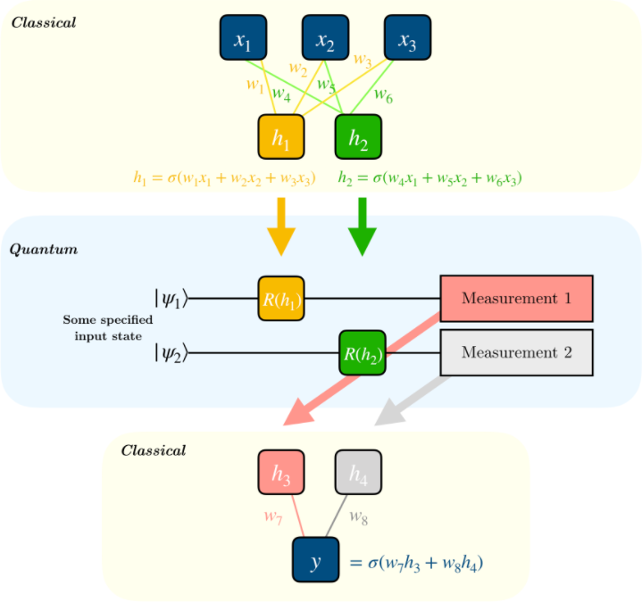
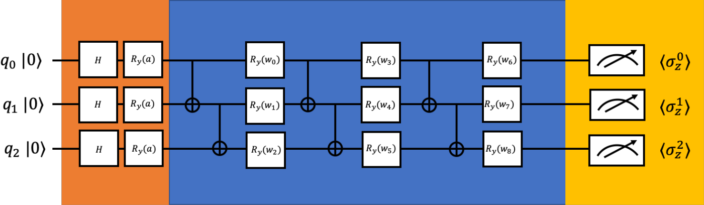

# Hybrid Quantum Classical Neural Networks

Hi There! 👋 
This is a repo where you have access to all the Jupiter Notebooks, along with some resources that made it all possible! 

## Table of Contents
* [What's Hybrid Quantum Classical Neural Networks?](##What's-Hybrid-Quantum-Classical-Neural-Networks?)
* [Diabetic Retinopathy](##Diabetic-Retinopathy)
* [Acknowledgements](##Acknowledgements)
* [Connect with me](##Connect-with-me)

## What's Hybrid Quantum Classical Neural Networks?

### TL;DR 
There are 2 parts to a Hybrid Quantum Classical Neural Network: The classical NN and the quantum circuit. The classical NN is your standard NN with it's inputs, weights and biases. The quantum part is acutally a Parameterized Quantum Circuit, with it's qubits, rotations and CNOT gates.

### A Longer Explanation:

 
Credit: Qiskit

Here's a diagram of what exactly a Hybrid Quantum Classical Neural Network looks like! We have a normal neural network at the top which just takes in all the data and computes and compresses it down to a lower size. Then we take the outputs of that classical networks and use it as the rotations of our qubits. Finally we take the outputs of those qubits and put them inside of another classical neural network, which then outputs the result

That's a nice scaled down version of the Hybrid Quantum Classical Neural Network. I did it a bit different. For the first part, I didn't just use classical neural networks. I used a CNN (So Conv2d, Maxpooling, Relu) along with some linearl layers attatched to the end (with dropout and Relus). Now comes the PQC! In the diagram there are 2 qubits, each with only 1 rotation, but we can do a lot more with the PQC! Take for example this:

 
Credit: https://arxiv.org/pdf/1912.06184.pdf

I used this circuit inside of my Hybrid Quantum Classical Neural Network, and it works quiet well! There are 3 qubits, each with 3 rotations. There's 1 rotation that's done on every single qubit (hence 7 parameters). I took these outputs and put them into another classical neural network to obtain the results!

The hardest part of coding this all was the backpropbagation. You can't preform backpropagation inside of a PQC, so I did the next best thing - Parameter shift rule. Instead of the derivitive of the parameter, you just find the difference between a little nudge to the left and the little nudge to the right. We're nudging one of the parameters. Using this we can feed it into the loss backwards so we can update all the parameters!

## Diabetic Retinopathy
Diabetic Retinopathy is a disease that's caused by diabeties. It occurs then the blood vessles at the back of your eye become damaged. There are 4 stages (5 if you include no Diabetic retinopathy) of the disease, ranging from symptoms of mild vison problems and progressing towards blindness. This is a tremendous point of suffering for the human population - this project aims to stop that. 

Those those living in rural and poor areas, screening for this disease is game changing. But problems arise when you don't have easy access to a doctor. With this model, we can diagnose diseases via a normal phone! 

Now, practically speaking, we don't need the quantum part of our model. But it's just fun to include and play around with!

If you're curious to learn more - check out my [Article!](https://dickson-wu.medium.com/using-hybrid-quantum-classical-neural-networks-to-screen-diabetic-retinopathy-10bc0a633a10) Also check out my [Video!](https://youtu.be/kYPS387eLM8)

## Acknowledgements

* [Information about QML in General](https://arxiv.org/pdf/1907.05415.pdf)
* [Information about QML in General](https://medium.com/meetech/highlighting-quantum-computing-for-machine-learning-1f1abd41cb59)
* [Information about QML in General](https://pennylane.ai/qml/whatisqml.html)
* [Information about QML in General](https://www.youtube.com/watch?v=OKbcJCUx6xA)
* [Information about QML in General](https://www.youtube.com/watch?v=DmzWsvb-Un4)
* [Helped with the code of Hybrid Quantum Classical Neural Networks](https://qiskit.org/textbook/ch-machine-learning/machine-learning-qiskit-pytorch.html)
* [Paper about using Hybrid Quantum Classical Neural Networks](https://arxiv.org/pdf/1912.06184.pdf)
* [Paper about using Hybrid Quantum Classical Neural Networks](https://arxiv.org/pdf/2003.02989.pdf)
* [Paper about Hybrid Quantum Classical Neural Networks Parameter Shift Rule](https://arxiv.org/pdf/1905.13311.pdf)
* [Information about Hybrid Quantum Classical Neural Networks](https://www.youtube.com/watch?v=-o9AhIz1uvo)
* [Information about Hybrid Quantum Classical Neural Networks](https://medium.com/ai-in-plain-english/hybrid-quantum-classical-machine-learning-️-f08ad3c2a53a)

## Connect with me

If you want to follow along on my journey, you can join my [monthly newsletter](https://www.subscribepage.com/g1p8w4), check out my [website](https://dicksonwu654.github.io/), and connect on [Linkedin](https://www.linkedin.com/in/real-dickson-wu/) or [Twitter](https://twitter.com/DicksonWu3) 😃
